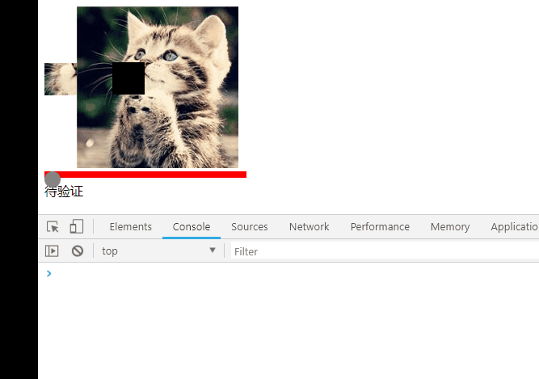

# sliding-verification-code

react 滑动验证码

```bash
npm i react-sliding-verification // 未发布
```



```javascript
import React, { useState } from "react";
import ReactDOM from "react-dom";
import SlidingVerification from "../src/index";

const srcArr = [
    "https://avatars0.githubusercontent.com/u/20512530?s=460&v=4",
    "https://avatars2.githubusercontent.com/u/7917954?s=400&v=4"
];

const App = () => {
    const [text, setText] = useState("待验证");
    const [srcIndex, setSrcIndex] = useState(0);
    return (
        <div>
            <SlidingVerification
                src={srcArr[srcIndex % 2]}
                onSlide={number => console.log(number)}
                onFinish={isOK => {
                    if (isOK) {
                        setText("验证成功");
                    } else {
                        setText("待验证");
                    }
                }}
            />
            <button onClick={() => setSrcIndex(srcIndex + 1)}>切换图片</button>
            <div style={{ marginTop: "5px" }}>{text}</div>
        </div>
    );
};
ReactDOM.render(<App />, document.getElementById("app"));
```

### props

-   src string 必选

    图片的地址

-   onFinish: (isOK: boolean) => {}

    是否识别成功

-   onSlide: (length: number) =>{}

    还差多少像素重合

-   innerLengthPencent number (0-0.2)

    内部缺块正方形占图片的百分比

-   errorRange number 可选

    误差像素允许范围，默认 10px

-   innerColor string 可选

    内部缺块颜色，默认"#000000"

-   isErrorChange boolean 可选

    验证错误时是否重新生成位置，默认 true

### todo

样式弄好看点 && 自定义样式 && 测试

不规则图像生成、速度控制等等...

### 开发预览

```bash
npm run dev // 8000端口
```

### 构建

```bash
npm run build
```
